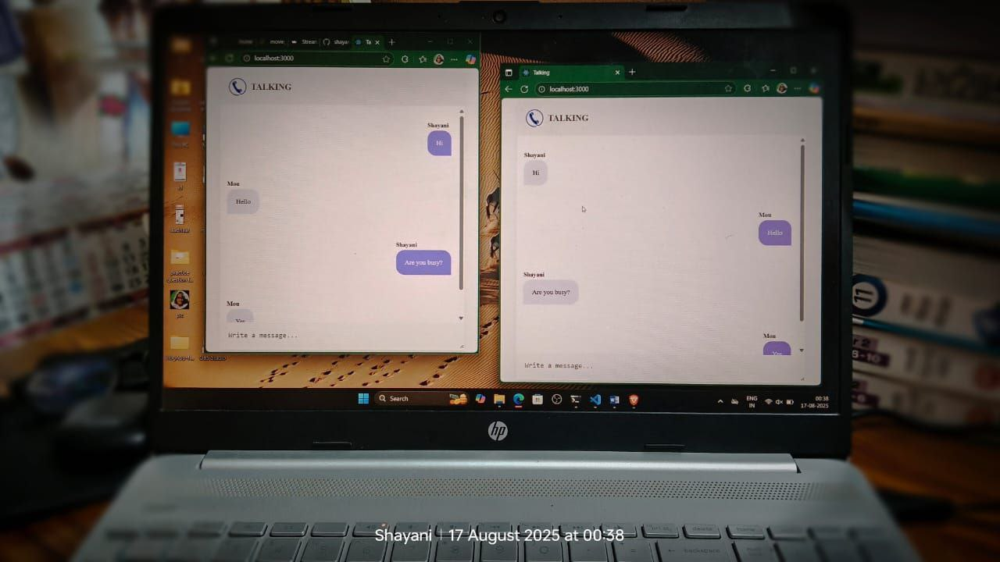
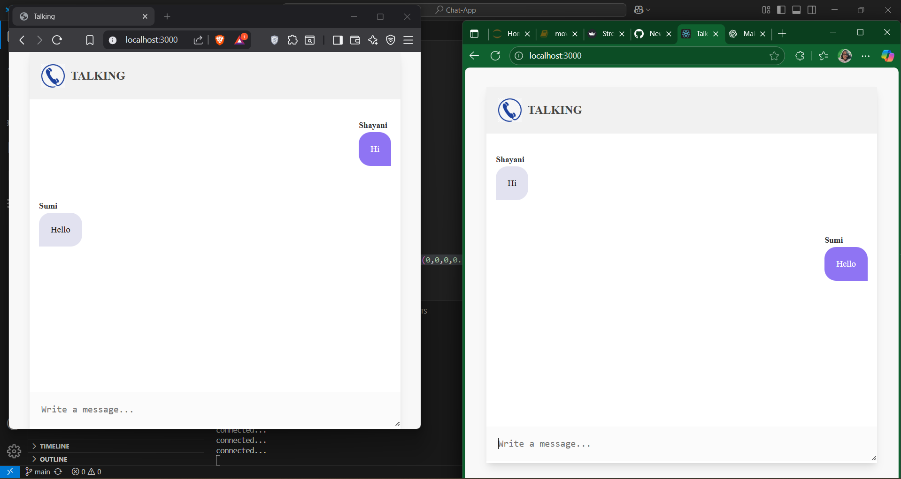

# 💬 Talking - Real-time Chat Application  



This is a simple real-time chat application built using **Node.js**, **Express**, and **Socket.IO**.  
It allows users to send and receive messages instantly between different browsers or tabs on the same computer.  

---

## 🚀 Features  
- Real-time communication using **Socket.IO**.  
- Works across **different tabs** or even **different browsers**.  
- Each user enters their name before chatting.  
- Incoming and outgoing messages are styled differently.  
- Messages automatically scroll to the bottom.  

---

## 🖼️ Preview  
Here’s how the chat looks in different browser:  




---

## 🛠️ Installation & Setup  

### 1️⃣ Clone the Repository  
```bash
git clone https://github.com/your-username/talking-chat-app.git
cd talking-chat-app
```

### 2️⃣ Install Dependencies

Make sure you have Node.js installed. Then run:
```bash
npm install
```
### 3️⃣ Start the Server
```bash
node server.js
```
### By default, the server runs on:
```bash
[npm install](http://localhost:3000)
```

